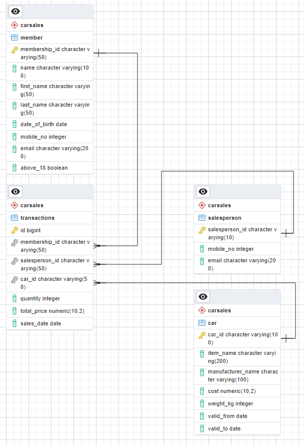

### Section 2 - Databases
---
- To start the database and pgadmin:
```
docker-compose up
```

- Star schema of the design


- Queries for the two questions are saved as query1.sql and query.sql

- To use pgadmin, visit localhost:5088. Connect to the DB as below. Account details can be found in docker-compose.yml


### *Some design considerations/assumptions:*


"price" is not necessarily equal to cost. Cost of the same car item could vary over time, and the actual transaction price would depend on many other factors, e.g. promotions. In view of this, total_price column is left under the fact table. Cost is part of the car dimension table.

Car table is modeled as Type 2 SCD with valid date columns, as historical cost values could be useful in downstream data analysis. It is possible to normalize the car table further into a series of smaller tables. For the sake of simplicity in OLAP analysis it is not done that way here.

Member and salesperson tables are considered as Type 1 SCD.

