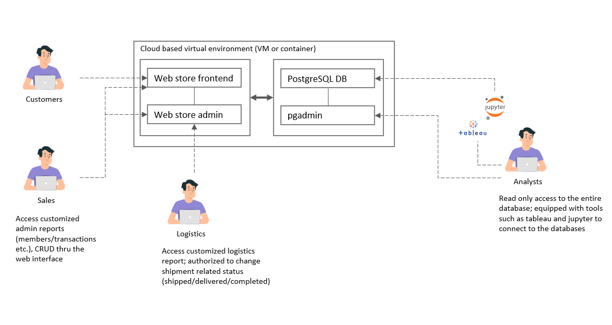
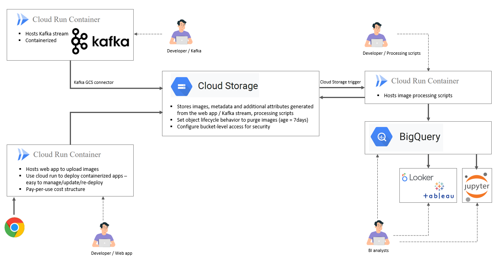

### Section 3 - System Design
### *Design 1:*
- One assumption made here is that sales and logistics folks are not tech-savvy, so an easy-to-use, spreadsheet-like web based interface need to be prepared for them to view and update the data.
- To track the status of the transactions, we can create a "status" flag in the transactions table, with values like ['created', 'paid', 'shipped', 'delivered', 'completed', 'returned'].
- Access to various tables need to be separated and based on need. For example, sales have the right to update the transactions table and the dimension tables only through the web admin portal, while logistics only need to view the summary report and modify the "status" flag.
- Analysts may need a variety of tools (tableau/jupyter/pgadmin) to access the database.
- One possible solution is to use [Wordpress Woocommerce](https://wordpress.org/plugins/woocommerce/) to set up and deploy the application quickly.

### *Design 2:*
- The Kafka stream, web app and processing scripts could come from different teams and are handled by different devolopers from time to time. Because of this they have been separated into their own modules in the setup, and containerized so that they are easy to manage and maintain. Access to various modules, as well as storage buckets are granted on need basis.
- The solution presented here is based on GCP. Cloud Run is used to host the containers. It also has a pay-per-use structure which is cost efficient. Cloud Storage is used to store the data, with retention policies set up to meet the requirement.
- Whenever possible, we should leverage on the connectors provided by GCP (such as Kafka connector and Cloud Storage trigger) to establish secure data flow between modules. We should strive to keep the setup simple so that users will focus on the data and the scripts instead of the architecture.

