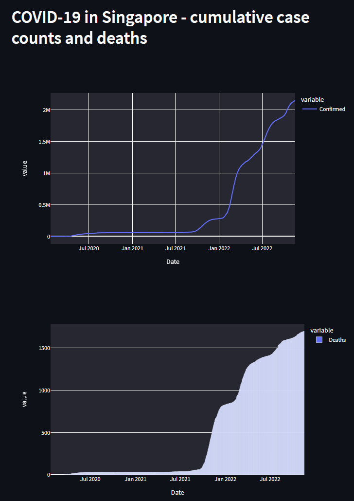

### Section 4 - Charts & APIs
---
- A simple streamlit app is set up to display the charts
 

- To install the required pkgs and run the app:
```
pip install streamlit plotly pandas requests json
streamlit run app.py
```